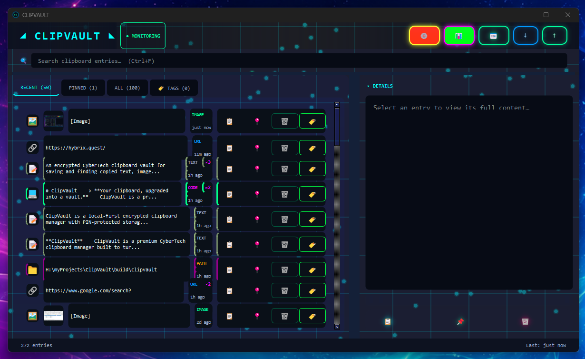

# ClipVault

> **Your clipboard, upgraded into a vault.**

ClipVault is a professional, local-first clipboard manager with encrypted vault storage, PIN protection, text/image capture, smart filtering, search, tags, pinned entries, global hotkeys, a paste ring, timeline analytics, and a CyberTech desktop interface.

It is built for people who copy important things all day and do not want those fragments to vanish: developers, creators, streamers, researchers, writers, AI power users, support agents, and anyone whose workflow depends on fast recall.

<p align="center">
  
</p>

> Screenshot placeholder: add `docs/screenshot-main.png` after capture.

---

## What ClipVault Does

Your operating system clipboard is temporary. ClipVault turns it into a searchable command vault.

ClipVault watches your clipboard, captures useful text and images, classifies entries, removes duplicate noise, protects saved history behind an encrypted PIN-based vault, and gives you fast ways to find, pin, tag, copy, export, import, analyze, and reuse previous clips.

This is **not** a media clip organizer. In ClipVault, “clip” means **clipboard clip**: copied text, URLs, code, paths, numbers, emails, screenshots, and other workflow fragments.

---

## Highlights

* **Encrypted clipboard vault** using Fernet encryption and PIN-derived keys.
* **PIN-gated startup** before vault contents are loaded.
* **Text clipboard monitoring** with automatic entry creation.
* **Image clipboard capture** with base64 PNG storage.
* **Optional OCR support** for searchable copied images.
* **Automatic type detection** for text, URL, email, code, number, path, image, and sensitive entries.
* **Sensitive data blocking** for common secrets such as credit-card-like values, SSNs, OTP-style codes, and long API-key-like strings.
* **Smart dedupe** to merge or avoid repeated near-identical clips.
* **Pinned entries** for important clips that should stay visible.
* **Tags and notes** for organization.
* **Fast search** across clipboard history.
* **Recent search suggestions** with saved search history.
* **Paste Ring** for cycling through recent clips with a hotkey.
* **Command Palette** for quick keyboard-driven actions.
* **System tray quick panel** for lightweight access without opening the full window.
* **Timeline view** with daily capture heatmap.
* **Stats dashboard** with entry counts, activity, type distribution, and vault size.
* **Retention controls** for max age and max entry count.
* **Incognito mode** for temporary sessions that do not persist saved entries.
* **Pause capture** when you need the monitor to stop watching.
* **App/window exclusions** and custom regex block rules.
* **Auto-lock** after idle time.
* **Import/export** via JSON.
* **CyberTech UI** with neon panels, animated background, glow buttons, and motion controls.

---

## Feature Tour

### Encrypted Vault

ClipVault stores clipboard entries in an encrypted vault file at:

```text
~/.clipvault/vault.encrypted
```

The encryption key is derived from your PIN using PBKDF2-HMAC-SHA256 and Fernet encryption. The vault uses a generated salt stored separately at:

```text
~/.clipvault/salt
```

Current storage code uses **600,000 PBKDF2 iterations** for new vault access, with compatibility logic for older vaults created at **100,000 iterations**.

### Clipboard Capture

ClipVault captures:

* Plain text
* URLs
* Email addresses
* Code snippets
* File paths
* Numbers / expressions
* Copied images
* OCR text from copied images, when optional OCR dependencies are available

Text clips above the configured clipboard size limit are ignored to avoid huge accidental captures. Image capture stores copied images as PNG data and skips oversized images.

### Privacy Controls

ClipVault includes several guardrails for safer clipboard history:

* Pause capture
* Incognito mode
* App/window title exclusions
* Custom regex block patterns
* Sensitive data filtering
* Ephemeral OTP handling setting
* Auto-lock after idle time
* Retention limits
* Manual delete with undo window

### Organization

Entries can be:

* Pinned
* Tagged
* Given notes
* Filtered by tab
* Searched
* Viewed in detail
* Imported/exported
* Copied back to the clipboard

The main interface includes tabs for recent, pinned, all, and tagged views.

### Fast Controls

ClipVault is designed for keyboard-heavy workflows:

| Action          | Default Hotkey |
| --------------- | -------------: |
| Command Palette | `Ctrl+Shift+P` |
| Paste Ring      | `Ctrl+Shift+V` |
| Quick Search    | `Ctrl+Shift+F` |
| Toggle Pin      | `Ctrl+Shift+L` |
| Pause Capture   | `Ctrl+Shift+Q` |
| Copy Selected   |       `Ctrl+C` |
| Delete Selected |       `Delete` |
| Undo Delete     |       `Ctrl+Z` |

Global hotkeys are powered by `pynput` when available. In-app shortcuts continue to work even if global hotkey registration is unavailable.

### Paste Ring

The Paste Ring lets you cycle through recent text clips by repeatedly pressing the configured hotkey. ClipVault displays an on-screen overlay showing the current position and preview, then places the selected entry back onto the system clipboard.

### Tray Quick Access

Closing the main window hides ClipVault to the system tray instead of quitting. The tray menu and mini panel provide quick access to recent clips, copy actions, pinning, deletion, and the full app window.

---

## Tech Stack

* **Python 3.9+**
* **PyQt6** for the desktop interface
* **cryptography** for encrypted vault storage
* **pyperclip** for clipboard text operations
* **pynput** for global hotkeys
* **Pillow** optional image/OCR support
* **pytesseract** optional OCR bridge
* **rapidfuzz** optional fuzzy matching support
* **pytest** for tests
* **PyInstaller** for Windows executable builds

---

## Project Structure

```text
clipvault/
  app.py                      # Main application orchestration
  __main__.py                 # python -m clipvault entry point
  config.py                   # App constants, paths, defaults, theme tokens
  hotkeys.py                  # Global hotkey manager
  ocr.py                      # Optional OCR extraction helpers
  paste_ring.py               # Paste Ring cycling + OSD overlay
  utils.py                    # Logging, IDs, previews

  capture/
    monitor.py                # Clipboard polling thread for text/images
    filters.py                # Capture filters, sensitive blocking, exclusions

  models/
    entry.py                  # ClipboardEntry model, detection, serialization

  storage/
    vault.py                  # Encrypted vault save/load
    config_store.py           # Plain-text config, boards, search history

  ui/
    main_window.py            # Main window layout and tray setup
    entry_widget.py           # Entry cards/list widgets
    settings_dialog.py        # Appearance/capture/privacy/data/hotkey settings
    command_palette.py        # Keyboard command palette
    mini_panel.py             # Tray quick-access panel
    pin_dialog.py             # PIN unlock dialog
    stats_dialog.py           # Statistics dashboard
    timeline_dialog.py        # Calendar/heatmap timeline
    tag_editor.py             # Tag editor popup
    theme.py                  # Shared CyberTech styles
    glow_button.py            # Animated glowing buttons
    animated_background.py    # CyberTech animated background

tests/
  test_*.py                   # Unit tests for storage, entries, filters, tags, etc.

clipvault.spec                # PyInstaller spec
pyproject.toml                # Package metadata and dependencies
```

---

## Installation From Source

### 1. Clone the repository

```bash
git clone https://github.com/YOUR_USERNAME/ClipVault.git
cd ClipVault
```

### 2. Create a virtual environment

**Windows PowerShell:**

```powershell
python -m venv .venv
.\.venv\Scripts\Activate.ps1
```

**macOS / Linux:**

```bash
python3 -m venv .venv
source .venv/bin/activate
```

### 3. Install ClipVault

Minimal install:

```bash
python -m pip install --upgrade pip
python -m pip install -e .
```

Development install:

```bash
python -m pip install -e ".[dev]"
```

Full optional install:

```bash
python -m pip install -e ".[image,ocr,fuzzy,dev]"
```

> OCR requires the Python packages **and** a working Tesseract OCR installation on your system. If Tesseract is not installed, ClipVault still runs; OCR extraction simply returns no text.

---

## Running

Run from the installed console script:

```bash
clipvault
```

Or run the package directly:

```bash
python -m clipvault
```

On first launch, ClipVault asks for a PIN. That PIN is used to derive the encryption key for the vault.

---

## Building a Windows Executable

ClipVault includes a PyInstaller spec file.

Install PyInstaller:

```bash
python -m pip install pyinstaller
```

Build:

```bash
pyinstaller clipvault.spec --clean --noconfirm
```

The output executable is created at:

```text
dist/ClipVault.exe
```

The current spec embeds the icon from:

```text
assets/CLIPVAULT.ico
```

Make sure that file exists before building, or update `clipvault.spec` to point at your preferred icon path.

---

## Testing

Install development dependencies first:

```bash
python -m pip install -e ".[dev]"
```

Run tests:

```bash
pytest -q
```

If you run tests without installing the package in editable mode, use:

```bash
PYTHONPATH=. pytest -q
```

On Windows PowerShell:

```powershell
$env:PYTHONPATH="."
pytest -q
```

Some tests import PyQt6-backed modules, so make sure the base project dependencies are installed before testing.

---

## Data Locations

ClipVault stores user data under:

```text
~/.clipvault/
```

Important files:

| File                  | Purpose                                 | Encrypted? |
| --------------------- | --------------------------------------- | ---------: |
| `vault.encrypted`     | Saved clipboard entries                 |        Yes |
| `salt`                | KDF salt for PIN-derived encryption key |         No |
| `config.json`         | App settings                            |         No |
| `boards.json`         | Board/pin metadata                      |         No |
| `search_history.json` | Recent search history                   |         No |
| `clipvault.log`       | Debug/application log                   |         No |

### Important Security Notes

* Your saved clipboard entries are encrypted inside `vault.encrypted`.
* App settings, search history, and logs are not encrypted.
* Exported JSON files are not encrypted unless you encrypt them separately.
* If you forget the vault PIN, ClipVault cannot recover the encrypted vault contents.
* Clipboard managers can capture sensitive material. Use exclusions, regex block rules, pause capture, and incognito mode when working with passwords, financial data, tokens, private messages, or medical/legal/personal information.

---

## Configuration

Default configuration includes:

```json
{
  "autostart": false,
  "start_minimized": false,
  "cyber_intensity": 0.3,
  "reduce_motion": false,
  "disable_bg": false,
  "font_size": 12,
  "pause_capture": false,
  "incognito_mode": false,
  "exclude_apps": "",
  "block_patterns": "",
  "auto_lock": false,
  "lock_time": 10,
  "block_sensitive": true,
  "ephemeral_otp": true,
  "enable_retention": false,
  "retention_days": 30,
  "max_entries": 1000,
  "auto_backup": false,
  "backup_path": "",
  "smart_dedupe": true,
  "confirm_delete": true,
  "hotkey_command_palette": "Ctrl+Shift+P",
  "hotkey_paste_ring": "Ctrl+Shift+V",
  "hotkey_quick_search": "Ctrl+Shift+F",
  "hotkey_toggle_pin": "Ctrl+Shift+L",
  "hotkey_pause_capture_key": "Ctrl+Shift+Q",
  "paste_ring_enabled": true,
  "paste_ring_timeout": 10,
  "enable_ocr": false,
  "enable_search_history": true
}
```

Most settings can be changed from the in-app Settings dialog.

---

## Import / Export

ClipVault can export all entries to JSON and import them later.

Use export for:

* Manual backups
* Moving vault contents between installs
* Debugging
* Migration tooling

Use caution: exported JSON is plain text. Keep exports somewhere private or encrypt them separately.

---

## Recommended `.gitignore`

The source ZIP used for this repo may include build artifacts and local environment files. Do **not** commit those unless intentionally publishing a binary release.

Recommended `.gitignore`:

```gitignore
# Python
__pycache__/
*.py[cod]
*.pyo
*.pyd
.pytest_cache/
.mypy_cache/
.ruff_cache/
.coverage
htmlcov/

# Virtual environments
.venv/
venv/
env/

# Build outputs
build/
dist/
*.spec~

# Local app data
.clipvault/
*.log

# OS/editor noise
.DS_Store
Thumbs.db
.vscode/
.idea/

# Temporary exports/backups
clipvault_export.json
*.bak
*.tmp
```

If you want to keep `clipvault.spec`, remove `*.spec` from the ignore list or add an explicit allow rule:

```gitignore
!clipvault.spec
```

---

## Maintainer Notes Before Publishing

Before pushing the first public GitHub release:

* Add a real `LICENSE` file if using MIT.
* Add screenshots under `docs/` and update the image paths in this README.
* Decide whether to commit the icon asset path used by `clipvault.spec`.
* Keep `dist/`, `build/`, `venv/`, `__pycache__/`, and `.pytest_cache/` out of the repo.
* Sync the visible version number across `pyproject.toml` and `clipvault/__init__.py`.
* Consider adding a release checksum for downloadable `.exe` builds.
* Consider code signing Windows releases if distributing broadly.

---

## Roadmap Ideas

Potential future upgrades:

* Native encrypted export format.
* Optional portable mode.
* Better first-run onboarding.
* Configurable vault location.
* Per-entry encryption metadata display.
* Richer fuzzy search and search operators.
* Better duplicate review tools.
* Entry collections / boards surfaced more prominently in the UI.
* Screenshot capture shortcut.
* Per-app capture profiles.
* Installer with autostart option.
* Signed Windows builds.

---

## Troubleshooting

### The app opens but does not capture anything

Check Settings:

* Capture may be paused.
* Incognito mode may be enabled.
* The active app may match an exclusion rule.
* A regex block pattern may be filtering your content.
* Sensitive-data blocking may be rejecting the copied text.

### Global hotkeys do not work

Global hotkeys require `pynput` and may be blocked by OS permissions or conflicts with other apps. In-app shortcuts should still work while ClipVault is focused.

### OCR does not work

Install optional OCR dependencies and make sure Tesseract OCR is installed on your system. Without Tesseract, copied images can still be saved, but text extraction will be unavailable.

### Wrong PIN loads no entries

That is expected. The vault cannot be decrypted with the wrong PIN.

### Exported data looks readable

That is expected. JSON exports are not encrypted. Treat exported files as sensitive.

---

## License

MIT — see `LICENSE`.

---

## Credits

Built as a focused desktop utility for high-speed clipboard recall, privacy-aware capture, and CyberTech workflow control.

**ClipVault** — your clipboard was temporary. Now it has a vault.
